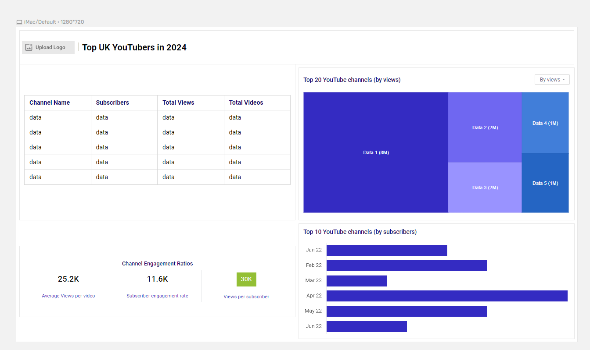
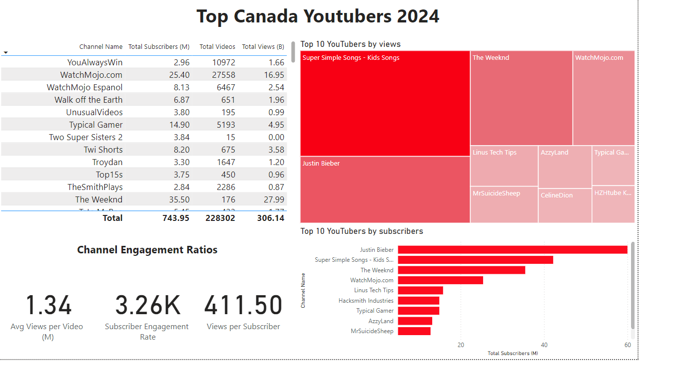

# Data Portfolio: Excel to Power BI


# Table of contents
- [Objective](#objective)
- [Data Source](#data-source)
- [Stages](#stages)
- [Design](#design)
  - [Mockup](#mockup)
  - [Tools](#tools)
- [Development](#development)
  - [Pseudocode](#pseudocode)
  - [Data Exploration](#data-exploration)
  - [Data Cleaning](#data-cleaning)
  - [Transform the Data](#transform-the-data)
  - [Create the SQL View](#create-the-sql-view)
- [Testing](#testing)
  - [Data Quality Tests](#data-quality-tests)
- [Visualization](#visualization)
  - [Results](#results)
  - [DAX Measures](#dax-measures)
- [Analysis](#analysis)
  - [Findings](#findings)
  - [Validation](#validation)
  - [Discovery](#discovery)
- [Recommendations](#recommendations)
  - [Potential ROI](#potential-roi)
  - [Potential Courses of Actions](#potential-courses-of-actions)
- [Conclusion](#conclusion)


# Objective 

- What is the key challenge? 

The Head of Marketing is looking to identify the top-performing YouTubers in Canada for 2024 to optimize influencer marketing campaigns for the remainder of the year. The goal is to pinpoint creators who align with brand values and reach the right audience for maximum impact.

- What is the ideal solution? 

Build an interactive dashboard that highlights the top Canadian YouTubers in 2024, offering data-driven insights such as:

Subscriber count
Total views
Number of videos
Engagement metrics (e.g., likes, comments, shares)

This dashboard will help the marketing team quickly assess which YouTubers are the best fit for collaboration, ensuring informed and impactful marketing decisions throughout the year.


## User Story

As the Head of Marketing, I want to use a dashboard that analyzes YouTube channel data in Canada. 

This dashboard should enable me to identify the top-performing channels based on metrics such as subscriber base, total views, and engagement rates. 

With this information, I can make informed decisions about which YouTubers are best to collaborate with, ensuring each marketing campaign is highly effective.

---

## Data Source

### What data is needed to achieve our objective?

We need comprehensive data on the top Canadian YouTubers in 2024, including:
- Channel names
- Total subscribers
- Total views
- Total videos uploaded
- Engagement metrics (e.g., likes, comments, shares)

This data will support identifying channels with strong audience engagement and growth potential for marketing collaborations.


- Where is the data coming from? 
The data is sourced from Kaggle (an Excel extract), [see here to find it.](https://www.kaggle.com/datasets/bhavyadhingra00020/top-100-social-media-influencers-2024-countrywise?resource=download)


# Stages

- Design
- Developement
- Testing
- Analysis 
 
# Design 

## Dashboard components required 
- What should the dashboard contain based on the requirements provided?

To understand what it should contain, we need to figure out what questions we need the dashboard to answer:

1. Who are the top 10 YouTubers with the most subscribers?
2. Which 3 channels have uploaded the most videos?
3. Which 3 channels have the most views?
4. Which 3 channels have the highest average views per video?
5. Which 3 channels have the highest views per subscriber ratio?
6. Which 3 channels have the highest subscriber engagement rate per video uploaded?

For now, these are some of the questions we need to answer, this may change as we progress down our analysis. 


## Dashboard mockup

- What should it look like? 

Some of the data visuals that may be appropriate in answering our questions include:

1. Table
2. Treemap
3. Scorecards
4. Horizontal bar chart

   


## Tools 


| Tool | Purpose |
| --- | --- |
| Excel | Exploring the data |
| SQL Server | Cleaning, testing, and analyzing the data |
| Power BI | Visualizing the data via interactive dashboards |
| GitHub | Hosting the project documentation and version control |
| Mokkup AI | Designing the wireframe/mockup of the dashboard | 


# Development

## Pseudocode

### General Approach to Creating the Solution:
1. **Obtain the Data:**
   - Collect the data on top Canadian YouTubers for 2024, including their subscriber count, total views, and engagement metrics.

2. **Data Exploration (in Excel):**
   - Open the dataset in Excel to inspect and explore.
   - Identify missing values, outliers, or potential errors.
   - Note the columns of interest for analysis.

3. **Load the Data into SQL Server:**
   - Create a database and load the cleaned data from Excel into SQL Server for further processing.

4. **Data Cleaning (SQL):**
   - Remove unnecessary columns.
   - Handle missing or inconsistent data.
   - Standardize formats (e.g., ensure subscriber counts and views are numeric).
   
5. **Data Validation (SQL):**
   - Verify that the cleaned data is accurate and complete.
   - Run queries to check the integrity of the data (e.g., no nulls in important columns like subscriber count).
   
6. **Data Visualization (Power BI):**
   - Import the cleaned data from SQL Server into Power BI.
   - Create visualizations for key metrics like subscriber growth, video count, and engagement rates.
   
7. **Generate Insights:**
   - Use the Power BI dashboard to analyze trends and identify the top Canadian YouTubers based on engagement, views, and subscribers.

8. **Document the Process and Findings:**
   - Write a detailed report explaining the data exploration, cleaning, analysis, and insights generated from the dashboard.
   
9. **Publish the Data and Results:**
   - Upload the project, including the Power BI dashboard and documentation, to GitHub Pages for public access.

---

## Data Exploration Notes

### Initial Observations of the Dataset:
1. **Relevant Data Columns:**
   - At least 4 columns contain the critical information needed for the analysis (e.g., channel names, subscribers, views, engagement metrics), indicating no need for additional data collection.

2. **Channel ID Format:**
   - The first column seems to hold YouTube channel IDs, often separated by the `@` symbol. We need to extract the proper channel names for easier reference in our analysis.

3. **Language Discrepancies:**
   - Some headers and data are in a different language. We need to determine whether these columns are relevant. If needed, we can translate or remove them to ensure consistency.

4. **Excessive Data:**
   - There’s more data in the dataset than we need for this analysis. Non-essential columns will be removed to focus on the key metrics.


## Data cleaning 
- What do we expect the clean data to look like? (What should it contain? What contraints should we apply to it?)

The aim is to refine our dataset to ensure it is structured and ready for analysis. 

The cleaned data should meet the following criteria and constraints:

- Only relevant columns should be retained.
- All data types should be appropriate for the contents of each column.
- No column should contain null values, indicating complete data for all records.

Below is a table outlining the constraints on our cleaned dataset:

| Property | Description |
| --- | --- |
| Number of Rows | 100 |
| Number of Columns | 4 |

And here is a tabular representation of the expected schema for the clean data:

| Column Name | Data Type | Nullable |
| --- | --- | --- |
| channel_name | VARCHAR | NO |
| total_subscribers | INTEGER | NO |
| total_views | INTEGER | NO |
| total_videos | INTEGER | NO |


- What steps are needed to clean and shape the data into the desired format?

1. Remove unnecessary columns by only selecting the ones you need
2. Extract Youtube channel names from the first column
3. Rename columns using aliases


### Transform the data 


```sql
/*
# 1. Select the required columns
# 2. Extract the channel name from the 'NAME' column
*/

-- 1.
SELECT
    SUBSTRING(NAME, 1, CHARINDEX('@', NAME) -1) AS channel_name,  -- 2.
    total_subscribers,
    total_views,
    total_videos

FROM
    top_canada_youtubers_2024
```


### Create the SQL view 

```sql
/*
# 1. Create a view to store the transformed data
# 2. Cast the extracted channel name as VARCHAR(100)
# 3. Select the required columns from the top_uk_youtubers_2024 SQL table 
*/

CREATE VIEW view_updated_canada AS

SELECT
	CAST(SUBSTRING(NAME, 1, CHARINDEX('@', NAME) - 1) AS VARCHAR(100)) as channel_name,
	total_subscribers,
	total_views,
	total_videos
FROM
	updated_canada;

```
# Testing 

- What data quality and validation checks are you going to create?

Here are the data quality tests conducted:

## Row count check
```sql
/*
# Count the total number of records (or rows) are in the SQL view
*/

--1 . Row count check

SELECT COUNT(*) as no_of_rows
FROM view_updated_canada;


```


## Column count check
### SQL query 
```sql
/*
# Count the total number of columns (or fields) are in the SQL view
*/

--2. Column count check

SELECT 
	COUNT(*) as column_count
FROM 
	INFORMATION_SCHEMA.COLUMNS
WHERE 
	TABLE_NAME = 'view_updated_canada';
```
### Output 


## Data type check
### SQL query 
```sql
/*
# Check the data types of each column from the view by checking the INFORMATION SCHEMA view
*/

--3. Data type check

SELECT
	COLUMN_NAME,
	DATA_TYPE
FROM
	INFORMATION_SCHEMA.COLUMNS
WHERE
	TABLE_NAME = 'view_updated_canada'
```
### Output


## Duplicate count check
### SQL query 
```sql
/*
# 1. Check for duplicate rows in the view
# 2. Group by the channel name
# 3. Filter for groups with more than one row
*/

--4. Duplicate records check

SELECT channel_name,
	COUNT(*) AS duplicate_count
FROM
	view_updated_canada
GROUP BY
	channel_name
HAVING
	COUNT(*) > 1;
```
### Output


# Visualization 


## Results

- What does the dashboard look like?



This shows the Top Canadian Youtubers in 2024 so far. 


## DAX Measures

### 1. Total Subscribers (M)
```sql
Total Subscribers (M) = 
VAR million = 1000000
VAR sumOfSubscribers = SUM(view_updated_canada[total_subscribers])
VAR totalSubscribers = DIVIDE(sumOfSubscribers, million)

RETURN totalSubscribers

```

### 2. Total Views (B)
```sql
Total Ciews (B) = 
VAR billion = 1000000000
VAR sumOfTotalViews = SUM(view_updated_canada[total_views])
VAR totalViews = DIVIDE(sumOfTotalViews, billion)

RETURN totalViews

```

### 3. Total Videos
```sql
Total Videos = 
VAR totalVideos = SUM(view_updated_canada[total_videos])

RETURN totalVideos

```

### 4. Average Views Per Video (M)
```sql
Avg Views per Video (M) = 
VAR sumOfTotalViews = SUM(view_updated_canada[total_views])
VAR sumOfTotalVideos = SUM(view_updated_canada[total_videos])
VAR avgViewsPErVideo = DIVIDE(sumOfTotalViews, sumOfTotalVideos, BLANK())
VAR finalAvgViewsPErVideo = DIVIDE(avgViewsPErVideo, 1000000, BLANK())

RETURN finalAvgViewsPErVideo

```


### 5. Subscriber Engagement Rate
```sql
Subscriber Engagement Rate = 
VAR sumOfTotalSubscribers = SUM(view_updated_canada[total_subscribers])
VAR sumOfTotalVideos = SUM(view_updated_canada[total_videos])
VAR subscriberEngRate = DIVIDE(sumOfTotalSubscribers, sumOfTotalVideos, BLANK())

RETURN subscriberEngRate

```


### 6. Views per subscriber
```sql
Views per Subscriber = 
VAR sumOfTotalViews = SUM(view_updated_canada[total_views])
VAR sumOfTotalSubscribers = SUM(view_updated_canada[total_subscribers])
VAR viewsPerSubscriber = DIVIDE(sumOfTotalViews, sumOfTotalSubscribers, BLANK())

RETURN viewsPerSubscriber

```


# Analysis 

## Findings

- What did we find?

For this analysis, we're going to focus on the questions below to get the information we need for our marketing client - 

Here are the key questions we need to answer for our marketing client: 
1. Who are the top 10 YouTubers with the most subscribers?
2. Which 3 channels have uploaded the most videos?
3. Which 3 channels have the most views?
4. Which 3 channels have the highest average views per video?
5. Which 3 channels have the highest views per subscriber ratio?
6. Which 3 channels have the highest subscriber engagement rate per video uploaded?


### 1. Who are the top 10 YouTubers with the most subscribers?

| Rank | Channel Name         | Subscribers (M) |
|------|----------------------|-----------------|
| 1    | Justin Bieber    | 73.20           |
| 2    |Super Simple Songs - Kids Songs            | 42.20           |
| 3    | The Weeknd           | 35.50          |
| 4    | WatchMojo.com          | 25.40           |
| 5    | Linus Tech Tips         | 15.80           |
| 6    | Hacksmith Industries                  | 14.90           |
| 7    | Typical Gamer                | 14.90           |
| 8    | AzzyLAnd             | 13.20           |
| 9    | MrSuicideSheep              | 12.80           |
| 10   | HZHtube Kids Fun                | 12.70           |


### 2. Which 3 channels have uploaded the most videos?

| Rank | Channel Name    | Videos Uploaded |
|------|-----------------|-----------------|
| 1    | Global News      | 41,059          |
| 2    | WatchMojo.com | 27,558           |
| 3    | Step News Agency        | 12,537           |


### 3. Which 3 channels have the most views?


| Rank | Channel Name | Total Views (B) |
|------|--------------|-----------------|
| 1    | Super Simple Songs - Kids Songs      | 51.73          |
| 2    | Justin Bieber   | 32.63           |
| 3    | The Weeknd   | 27.99           |


### 4. Which 3 channels have the highest average views per video?

| Channel Name | Averge Views per Video (M) |
|--------------|-----------------|
| Mark Ronson  | 32.27           |
| Jessie J     | 5.97            |
| Dua Lipa     | 5.76            |


### 5. Which 3 channels have the highest views per subscriber ratio?

| Rank | Channel Name       | Views per Subscriber        |
|------|-----------------   |---------------------------- |
| 1    | Super Simple Songs - Kids Songs          | 1,225.80                     |
| 2    | SpyCales        | 968.99                     |
| 3    | Super Simple ABCs | 950.31                     |


### 6. Which 3 channels have the highest subscriber engagement rate per video uploaded?

| Rank | Channel Name    | Subscriber Engagement Rate  |
|------|-----------------|---------------------------- |
| 1    | Justin Bieber    | 294,377.51                     |
| 2    | Two Super Sisters 2        | 256,000.00                  |
| 3    | The Weeknd        | 201,704.55                  |


### Notes

For this analysis, we'll prioritize analysing the metrics that are important in generating the expected ROI for our marketing client, which are the YouTube channels wuth the most 

- subscribers
- total views
- videos uploaded


## Validation 

### 1. Youtubers with the most subscribers 

#### Calculation breakdown

Campaign idea = product placement 

a. Super Simple Songs - Kids Songs
- Average views per video = 64.66 million
- Product cost = $5
- Potential units sold per video = 64.66 million x 2% conversion rate = 1,293,200 units sold
- Potential revenue per video = 1,293,200 x $5 = $6,466,000
- Campaign cost (one-time fee) = $50,000
- **Net profit = $6,466,000 - $50,000 = $6,416,000**

b. Justin Bieber

- Average views per video = 131.06 million
- Product cost = $5
- Potential units sold per video = 131.06 million x 2% conversion rate = 2,621,200 units sold
- Potential revenue per video = 2,621,200 x $5 = $13,106,000
- Campaign cost (one-time fee) = $50,000
- **Net profit = $13,106,000 - $50,000 = $13,056,000**

c. The Weeknd

- Average views per video = 159.03 million
- Product cost = $5
- Potential units sold per video = 159.03 million x 2% conversion rate = 3,180,600 units sold
- Potential revenue per video = 3,180,600 x $5 = $15,903,000
- Campaign cost (one-time fee) = $50,000
- **Net profit = $15,903,000 - $50,000 = $15,853,000**


Best option from category: The Weeknd


#### SQL query 

```sql
/* 

# 1. Define variables 
# 2. Create a CTE that rounds the average views per video 
# 3. Select the column you need and create calculated columns from existing ones 
# 4. Filter results by Youtube channels
# 5. Sort results by net profits (from highest to lowest)

*/


-- 1. Define the variables
DECLARE @conversionRate FLOAT = 0.02;
DECLARE @productCost MONEY = 5.0;
DECLARE @campaignCost MONEY = 50000.0;

-- 2. Create a CTE that rounds the average views per video
WITH ChannelData AS (
    SELECT
        channel_name,
        total_views,
        total_videos,
        -- Round to nearest whole number
        ROUND(CAST(total_views AS FLOAT) / NULLIF(total_videos, 0), 0) AS rounded_avg_views_per_video
    FROM
        view_updated_canada
)

-- 3. Select the columns required for analysis, filter by top subscribers
SELECT
    channel_name,
    total_views,
    rounded_avg_views_per_video,
    ((total_views * @conversionRate * @productCost) - @campaignCost) AS net_profit
FROM
    ChannelData


-- 4. Order by net_profit from highest to lowest
ORDER BY
    net_profit DESC;
```
#### Output

.png)

### 2. Youtubers with the most videos uploaded

### Calculation breakdown 

Campaign idea = sponsored video series  

1. **Global News**
- Average views per video = 70,000
- Product cost = $5
- Potential units sold per video = 70,000 x 2% conversion rate = 1,400 units sold
- Potential revenue per video = 1,400 x $5= $7,000
- Campaign cost (11-videos @ $5,000 each) = $55,000
- **Net profit = $7,000 - $55,000 = -$48,000 (potential loss)**

b. **WatchMojo.com**

- Average views per video = 620,000
- Product cost = $5
- Potential units sold per video = 620,000 x 2% conversion rate = 12,400 units sold
- Potential revenue per video = 12,400 x $5= $62,000
- Campaign cost (11-videos @ $5,000 each) = $55,000
- **Net profit = $62,000 - $55,000 = $7,000 (profit)**

c. **Step News Agency**

- Average views per video = 170,000
- Product cost = $5
- Potential units sold per video = 170,000 x 2% conversion rate = 3,400 units sold
- Potential revenue per video = 3,400 x $5= $17,000
- Campaign cost (11-videos @ $5,000 each) = $55,000
- **Net profit = $17,000 - $55,000 = -$38,000 (potential loss)**


Best option from category: WatchMojo.com

#### SQL query 
```sql
/* 
# 1. Define variables
# 2. Create a CTE that rounds the average views per video
# 3. Select the columns you need and create calculated columns from existing ones
# 4. Filter results by YouTube channels
# 5. Sort results by net profits (from highest to lowest)
*/


-- 1.
DECLARE @conversionRate FLOAT = 0.02;           -- The conversion rate @ 2%
DECLARE @productCost FLOAT = 5.0;               -- The product cost @ $5
DECLARE @campaignCostPerVideo FLOAT = 5000.0;   -- The campaign cost per video @ $5,000
DECLARE @numberOfVideos INT = 11;               -- The number of videos (11)


-- 2.
WITH ChannelData AS (
    SELECT
        channel_name,
        total_views,
        total_videos,
        ROUND((CAST(total_views AS FLOAT) / total_videos), -4) AS rounded_avg_views_per_video
    FROM
        youtube_db.dbo.view_uk_youtubers_2024
)


-- 3.
SELECT
    channel_name,
    rounded_avg_views_per_video,
    (rounded_avg_views_per_video * @conversionRate) AS potential_units_sold_per_video,
    (rounded_avg_views_per_video * @conversionRate * @productCost) AS potential_revenue_per_video,
    ((rounded_avg_views_per_video * @conversionRate * @productCost) - (@campaignCostPerVideo * @numberOfVideos)) AS net_profit
FROM
    ChannelData


-- 4.
WHERE
    channel_name IN ('GRM Daily', 'Man City', 'YOGSCAST Lewis & Simon ')


-- 5.
ORDER BY
    net_profit DESC;
```

#### Output


### 3.  Youtubers with the most views 

#### Calculation breakdown

Campaign idea = Influencer marketing 

a. Super Simple Songs - Kids Songs

- Average views per video = 64.66 million
- Product cost = $5
- Potential units sold per video = 64.66 million x 2% conversion rate = 1,293,200 units sold
- Potential revenue per video = 1,293,200 x $5 = $6,466,000
- Campaign cost (3-month contract) = $130,000
- **Net profit = $6,466,000 - $130,000 = $6,336,000**

b. Justin Bieber

- Average views per video = 131.06 million
- Product cost = $5
- Potential units sold per video = 131.06 million x 2% conversion rate = 2,621,200 units sold
- Potential revenue per video = 2,621,200 x $5 = $13,106,000
- Campaign cost (3-month contract) = $130,000
- **Net profit = $13,106,000 - $130,000 = $12,976,000**

c. The Weeknd

- Average views per video = 159.03 million
- Product cost = $5
- Potential units sold per video = 159.03 million x 2% conversion rate = 3,180,600 units sold
- Potential revenue per video = 3,180,600 x $5 = $15,903,000
- Campaign cost (3-month contract) = $130,000
- **Net profit = $15,903,000 - $130,000 = $15,773,000**

Best option from category: The Weeknd


#### SQL query 
```sql
/*
# 1. Define variables
# 2. Create a CTE that rounds the average views per video
# 3. Select the columns you need and create calculated columns from existing ones
# 4. Filter results by YouTube channels
# 5. Sort results by net profits (from highest to lowest)
*/


-- 1.
DECLARE @conversionRate FLOAT = 0.02;        -- The conversion rate @ 2%
DECLARE @productCost MONEY = 5.0;            -- The product cost @ $5
DECLARE @campaignCost MONEY = 130000.0;      -- The campaign cost @ $130,000


-- 2.
WITH ChannelData AS (
    SELECT
        channel_name,
        total_views,
        total_videos,
        ROUND(CAST(total_views AS FLOAT) / total_videos, -4) AS avg_views_per_video
    FROM
        youtube_db.dbo.view_uk_youtubers_2024
)


-- 3.
SELECT
    channel_name,
    avg_views_per_video,
    (avg_views_per_video * @conversionRate) AS potential_units_sold_per_video,
    (avg_views_per_video * @conversionRate * @productCost) AS potential_revenue_per_video,
    (avg_views_per_video * @conversionRate * @productCost) - @campaignCost AS net_profit
FROM
    ChannelData


-- 4.
WHERE
    channel_name IN ('Mister Max', 'DanTDM', 'Dan Rhodes')


-- 5.
ORDER BY
    net_profit DESC;

```

#### Output


